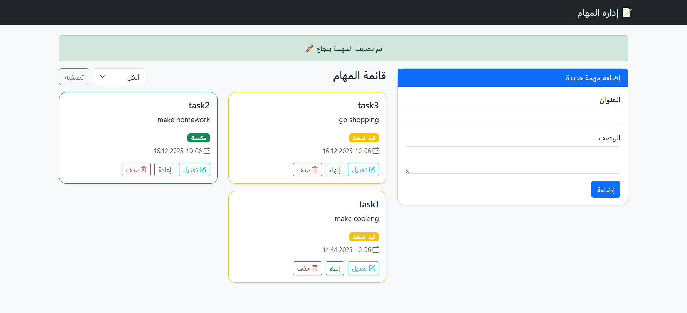

# 🗂️ Task Management App (Laravel)

<p align="center">
  
</p>

---

## 📸 صورة من المشروع

<p align="center">
  
</p>

> يمكنك استبدال `screenshot.png` باسم الصورة التي ترفعها داخل المشروع (مثلاً صورة لواجهة التطبيق).

---

## 📌 نبذة عن المشروع
تطبيق بسيط لإدارة المهام (To-Do List) تم تطويره باستخدام **Laravel Framework**.  
يسمح للمستخدم بإضافة مهام جديدة، تعديلها، حذفها، وتغيير حالتها (قيد التنفيذ / مكتملة).  
يهدف المشروع إلى تطبيق عملي لمفاهيم **CRUD Operations** في Laravel بطريقة منظمة وسهلة الاستخدام.

---

## ⚙️ المميزات الأساسية
- 📝 إضافة مهمة جديدة  
- ✏️ تعديل المهام الموجودة  
- 🗑️ حذف المهام  
- ✅ تحديث حالة المهمة (قيد التنفيذ ↔ مكتملة)  
- 🔍 فلترة المهام حسب حالتها  
- ⚡ واجهة بسيطة باستخدام **Blade + Fetch API**

---

## 🧱 التقنيات المستخدمة
- **Backend:** Laravel 12
- **Frontend:** Blade Template + HTML + CSS + JavaScript  
- **Database:** SQLite (يمكن تغييره إلى MySQL بسهولة)  
- **Version Control:** Git & GitHub  

---

## 🚀 طريقة التشغيل محليًا
1. انسخ المشروع من GitHub:
   ```bash
   git clone https://github.com/Fatma-Karam/laravel-task-app.git
   
   cd laravel-task-app
   composer install
   cp .env.example .env
   php artisan key:generate
   php artisan migrate
   php artisan serve
   http://localhost:8000


